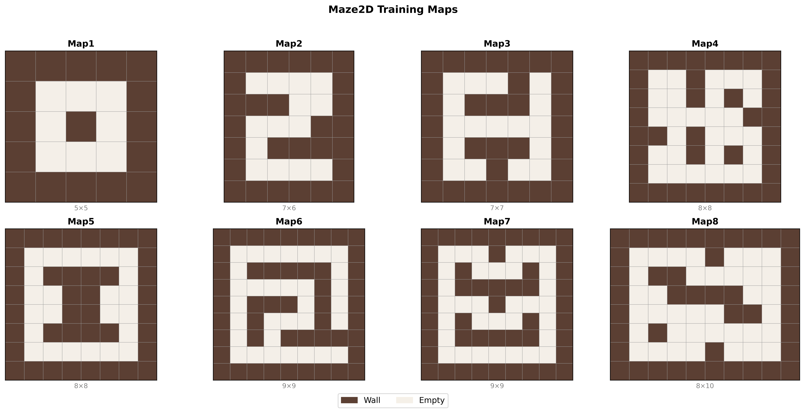

## Additional Experimental Results

### Maze2D Multi-Task Setting (8 Training Maps)

Training maps configuration:

*Figure 1: Eight training maps used in Maze2D multi-task experiments, ranging from simple (5×5) to complex (8×10) layouts.*

| Task | Ours | PromptDT |
|------|------|----------|
| maze2d-1 | 106.5 | 48.0 |
| maze2d-2 | 95.1 | 22.0 |
| maze2d-3 | 0.0 | 12.0 |
| maze2d-4 | 32.9 | 7.5 |
| maze2d-5 | 4.5 | 41.1 |
| maze2d-6 | 22.6 | 14.9 |
| maze2d-7 | 33.2 | 0.0 |
| maze2d-8 | 0.0 | 0.0 |
| **Average** | **36.9** | **18.2** |

*Table 1: Average return on 8 Maze2D training maps.*

---

### Ablation Study on ϵ in ARATC (Equation 9)

| ϵ | Scale return × 0.08 | Scale return × 0.1 (ours) | Scale return × 0.12 |
|---|---|---|---|
| MT30 | 89.33 | 89.67 | 88.67 |

*Table 2: Ablation on ϵ threshold in ARATC.*

---

### Learned Prompt Lengths under Different Settings (LGPM)

| Task | MT5 | MT30 near-optimal | MT30 sub-optimal |
|------|-----|-------------------|------------------|
| ***basketball-v2*** | 18 | 24 | 36 |
| ***reach-v2*** | 8 | 6 | 10 |
| button-press-topdown-v2 | 10 | 20 | 26 |
| button-press-v2 | 20 | 10 | 19 |
| button-press-wall-v2 | 10 | 21 | 27 |

*Table3 : Learned prompt lengths for representative tasks under MT5, MT30 near-optimal, and MT30 sub-optimal settings.*
